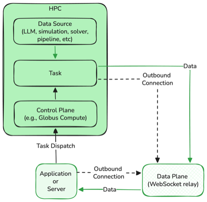

# Summary

HPC clusters hold the most powerful open-source models and scientific computing
resources available — but they are structurally inaccessible to interactive use.
Job schedulers (SLURM, PBS, Globus Compute [@globuscompute2024]) execute jobs to
completion and return a single result. Any application that needs to observe output
as it is produced — an LLM chat interface seeing the first token, a simulation
monitor watching convergence, a genomics dashboard tracking pipeline progress —
is fundamentally incompatible with this model.

The core barrier is not bandwidth or latency: it is the **control/data entanglement**
in standard HPC dispatch. When job submission, authentication, and result delivery
all travel the same path, streaming is impossible without either changing the
scheduler or opening inbound firewall ports — neither of which is practical across
institutional HPC environments.

`streamrelay` solves this with a **dual-channel architecture** that separates these
concerns. The existing job dispatch framework (Globus Compute, SLURM, PBS) remains
the **control plane** — handling authentication, scheduling, and status reporting
unchanged. A new, independent **data plane** — a lightweight WebSocket relay server —
carries incremental output from the compute node to the application in real time.
Both the HPC node (producer) and the application (consumer) connect **outbound** to
the relay over `wss://` port 443; neither accepts an inbound connection, so no
firewall exceptions or VPN are required.

The architectural separation has a measurable consequence: deployed in the STREAM
system [@nassar2026stream] against a Qwen 2.5 72B model on an NVIDIA H100 at UIC's
Lakeshore cluster, `streamrelay` achieves **0.60 s median time-to-first-output**
(steady state) — a **26× improvement** over the 15.9 s cold-start batch latency from
the same infrastructure, and consistent with the 16.3 s median reported by FIRST
[@first2025] for a comparable Globus Compute deployment without streaming.

The dual-channel separation also unlocks a deployment pattern that was previously
impractical: **HPC-as-API**. Because the data plane is decoupled from the control
plane, a thin HTTP proxy can sit in front of both and expose the entire stack as a
standard OpenAI-compatible `POST /v1/chat/completions` endpoint. A researcher with
an AWS server, a LangChain application, or an Amplify backend can call a 72B
parameter model running on an H100 cluster using the same client code they use for
any cloud provider — with no Globus account, no HPC allocation, and no knowledge of
the relay. The library provides the authentication architecture to make this
institutional-grade: dual-mode federated auth (Globus Token Auth for per-user SLURM
attribution; API Key Auth for external service callers), per-caller rate limiting,
and input validation, all described in the HPC-as-API section below.

The relay is entirely **scheduler-agnostic** and **payload-agnostic**: the same
architecture applies to any HPC job that produces incremental output. LLM inference
is the motivating use case and primary benchmark, but molecular dynamics trajectory
frames, iterative solver convergence metrics, genomics pipeline records, or any
JSON-serializable incremental data follow the same producer/consumer pattern with no
changes to the relay or consumer code.

The library provides: a relay server (`streamrelay` CLI or `start_relay()` API);
`RelayProducer` and `RelayConsumer` client classes with synchronous and asynchronous
interfaces; optional AES-256-GCM end-to-end encryption so the relay operator cannot
read message payloads even if the relay VM is compromised [@nist_gcm]; a high-level
`StreamingExecutor` class for Globus Compute users; and the HPC proxy layer
(`pip install streamrelay[proxy]`) for the HPC-as-API deployment pattern.

# Statement of Need

## The structural barrier

HPC clusters provide GPU and CPU resources unavailable on personal hardware at no
marginal cost to researchers. They are the natural home for computation-intensive
workloads: large language model inference on 70B+ parameter models, molecular
dynamics simulations, iterative optimization, real-time data pipelines. But HPC
batch execution is fundamentally incompatible with streaming.

Globus Compute [@globuscompute2024], a widely used federated function execution
service for HPC, returns a single result when a function completes — there is no
mechanism for incremental output delivery during execution. Several HPC centers have
deployed LLM inference services [@first2025; @dartmouth2025; @purdue2025; @chatai2024];
a recurring limitation is the absence of streaming. The FIRST system [@first2025] at
Argonne National Laboratory reports 16.3 s median time-to-first-token as a direct
consequence of batch execution. The same limitation affects any HPC workload that
produces output incrementally: iterative solvers that could emit convergence metrics
at each step, molecular dynamics simulations that produce trajectory frames
continuously, and real-time data pipelines that process records as they arrive all
reduce to a black-box wait under the batch model.

The problem is structural, not incidental. Standard HPC dispatch entangles the
control path (authentication, job routing, status reporting) with the data path
(result delivery). Streaming requires breaking this entanglement — either by
modifying the scheduler (impractical at most institutions), opening inbound firewall
ports on compute nodes (blocked by institutional policy), or finding an architecture
that routes around both constraints.

## The dual-channel solution

`streamrelay` routes around both constraints by separating the control and data
planes. The existing dispatch framework handles everything it already handles. The
relay handles only one thing: forwarding incremental output from producer to consumer
in real time, with both sides connecting outbound. This separation requires no
changes to the scheduler, no firewall exceptions, and no VPN.

The relay connection (`ws_connect`) is entirely independent of how the producer
obtains its data: replacing the LLM HTTP stream with a subprocess pipe, a file
iterator, or a socket yields the same architecture with no changes to the relay or
consumer. `streamrelay` is designed to be embedded in any HPC application as a
library, or used standalone as a relay server, with no scheduler dependencies.
Existing solutions either require inbound connections (precluded by HPC firewalls)
or are tightly coupled to a single scheduler or middleware stack.

## What becomes possible: HPC-as-API

The latency improvement — 0.60 s median vs. 15.9 s batch — is the direct,
measurable consequence of the dual-channel architecture. But the more significant
consequence is what it enables downstream.

With streaming solved and sub-second TTFT demonstrated, it becomes practical to
expose HPC inference as a standard API: callers use a `POST /v1/chat/completions`
endpoint with a bearer token, and the entire dual-channel flow (Globus dispatch,
relay consumer, SSE response) is hidden inside the proxy. Any OpenAI-compatible
client — LangChain, LlamaIndex, AWS Amplify, OpenWebUI, Cursor — works without
modification. The HPC cluster has no public IP; no inbound ports are opened; the
only infrastructure change is a small public relay VM.

Without the dual-channel architecture, this deployment pattern is impossible:
a proxy that internally makes a batch HPC call would impose 15+ second latency on
every API call, making it unusable for interactive applications. The 26× latency
improvement is what transforms HPC inference from a research tool into a callable
service.

This accessibility gap is significant. Institutional HPC clusters run models that
rival or exceed frontier cloud providers in quality, at zero marginal cost — yet
they are unreachable to the majority of developers and researchers who do not have
HPC accounts or expertise. `streamrelay`'s HPC-as-API pattern closes this gap for
any institution running Globus Compute.

# Design and Implementation

## Architecture

`streamrelay` separates concerns into two independent planes (Figure 1):

- **Control plane**: the user's existing job submission framework handles
  authentication, job dispatch, and final result retrieval. `streamrelay` does not
  touch this.
- **Data plane**: `streamrelay` carries incremental output from the compute node
  to the application in real time, independently of when the job completes.



The relay server maintains a **channel registry**. A channel is a matched pair of
WebSocket connections identified by a UUID (122 bits of entropy, computationally
infeasible to guess). The producer connects to `/produce/{channel_id}` and the
consumer connects to `/consume/{channel_id}`. The relay forwards JSON messages from
producer to consumer without interpretation.

**Buffering.** Messages arriving before the consumer connects are held in memory
(configurable limit, default 1,000 messages) and flushed when the consumer connects.
This handles the common case where the producer (HPC node) begins generating output
before the consumer (application) has established its connection.

**Orphan reaping.** A background task periodically removes channels where one side
never connected within a configurable timeout (default 300 seconds), preventing
memory leaks from failed or cancelled jobs.

**Per-query stateless channels.** Channels are ephemeral by design: a fresh UUID
channel is created for every job submission, and both producer and consumer disconnect
once the channel is cleaned up. This is a deliberate architectural choice with
important consequences for multi-user HPC deployments: there is no shared state
between concurrent jobs, no persistent connection to maintain or recover, and no
reconnect logic in the client. A failed or cancelled job simply abandons its channel,
which the orphan reaper reclaims. The consumer always connects first (immediately on
job submission) and the producer connects shortly after (once the HPC scheduler
dispatches the task). The in-process FIFO buffer bridges this gap so no messages are
lost. UUID channel IDs (122 bits of entropy) make unauthorized channel access
computationally infeasible, providing isolation between concurrent users without
any per-user authentication at the relay layer.

## Message protocol

All messages are JSON strings forwarded by the relay without interpretation. The
protocol defines three control messages; the content of `"data"` is opaque to the
relay and can carry any application payload:

```
{"type": "data",   "payload": <any JSON>}  ← one incremental result
{"type": "done",   "meta": {...}}          ← job complete (optional metadata)
{"type": "error",  "message": "..."}       ← something went wrong on the producer
```

For backward compatibility with the LLM streaming convention used in STREAM
[@nassar2026stream], producers may also send `{"type": "token", "content": "..."}`,
which consumers treat identically to `"data"`.

When end-to-end encryption is enabled, each message is wrapped before transmission:

```
{"type": "enc", "d": "<base64(nonce + ciphertext + GCM tag)>"}
```

## Security

`streamrelay` enforces three independent security layers:

**Transport security (TLS).** Deploying the relay behind a TLS-terminating reverse
proxy (e.g., Caddy with auto-provisioned Let's Encrypt certificates) encrypts all
traffic in transit via `wss://`. See `docs/deployment.md` for a production setup.

**Access control (shared secret).** The relay accepts an optional pre-shared secret
(`--secret` flag or `RELAY_SECRET` environment variable). Every producer and
consumer must supply the same value at the WebSocket handshake; connections without
the correct secret are rejected before any channel state is created. The relay holds
no persistent state — all channel information is discarded once both sides
disconnect, and no authentication credentials traverse the relay.

**End-to-end payload encryption (AES-256-GCM).** TLS protects the link to the
relay but leaves message payloads visible to the relay operator. For sensitive
workloads — medical data, financial computations, proprietary simulation results —
`streamrelay` optionally encrypts each message with AES-256-GCM [@nist_gcm]: the
producer encrypts with a fresh 12-byte random nonce per message (`os.urandom(12)`),
the relay forwards opaque ciphertext, and the consumer decrypts. The 16-byte GCM
authentication tag detects any in-transit tampering before any plaintext is returned.
The relay operator sees only ciphertext. This layer is opt-in and backward-compatible
with unencrypted connections on the same channel.

Keys and secrets are represented as 64-character hex strings (not base64) to avoid
the `+`, `/`, and `=` characters that cause parsing problems in `.env` files, shell
`export` statements, and YAML `worker_init` blocks on HPC endpoints. Generate with:
`python -c "import secrets; print(secrets.token_hex(32))"`.

The shared secret and encryption key are delivered to the compute node as job
arguments or environment variables — the same mechanism used for all other job
parameters in SLURM, PBS, and Globus Compute workflows. For Globus Compute
deployments where task arguments travel over Globus's own encrypted AMQP channel,
the encryption key should instead be set as an environment variable in the endpoint's
`worker_init` block so it never appears as a task argument. No changes to cluster
authentication infrastructure are required.

## Scheduler-agnostic design

The relay protocol places one requirement on the compute node: outbound TCP
access to the relay server's port (443 for `wss://`). This is standard policy at
most institutional HPC centers — the same outbound access that Globus Compute uses
for its own AMQP task routing. Because `streamrelay` does not interact with the
scheduler, it is compatible with any execution model, including environments where
installing Python packages on compute nodes is restricted: the inline producer pattern
(documented in `docs/tutorial.md`) requires only `websockets` and `cryptography`,
which are commonly available on HPC environments without additional installation.

## HPC-as-API deployment pattern

`streamrelay` enables a deployment pattern that makes HPC inference callable from
any OpenAI-compatible client — with no changes to the cluster, no public IP on the
HPC side, and no HPC knowledge required by the caller. The architecture has three
components:

1. **`streamrelay` relay server** — runs on a small public VM (the only component
   that needs a public IP). Handles token forwarding between HPC and the proxy.

2. **HPC inference proxy** — a thin HTTP service on the same public VM that accepts
   standard `POST /v1/chat/completions` requests, runs the full dual-channel flow
   internally (Globus Compute dispatch + relay consumer), and returns an
   OpenAI-compatible SSE stream to the caller.

3. **TLS + bearer token** — Caddy terminates TLS; the proxy validates a pre-issued
   API key on every request. The Globus OAuth2 credentials never leave the proxy VM.

From the caller's perspective, invoking a 72B model on an H100 cluster looks
identical to calling a cloud provider:

```python
client = openai.OpenAI(
    base_url="https://hpc-api.institution.edu/v1",
    api_key="sk-xxxx"
)
response = client.chat.completions.create(
    model="Qwen/Qwen2.5-VL-72B-Instruct-AWQ",
    messages=[{"role": "user", "content": "Explain transformer attention."}],
    stream=True
)
```

The caller does not need a Globus account, an HPC allocation, or knowledge of the
relay. Multiple models running on the cluster are accessible by name via the
standard `model` field. If a model is unavailable, the proxy returns a standard
HTTP 503 with a descriptive message.

**Authentication architecture.** The proxy implements two coexisting auth modes.
For direct university users, Globus Token Auth validates an incoming Globus access
token against Globus Auth's public introspect endpoint and checks the caller's email
domain (e.g., `@uic.edu`), establishing the caller's identity without any per-user
admin configuration on the endpoint. In the current implementation, the proxy submits
Globus Compute jobs under its own stored credentials; the caller's Globus token is
retained for a planned extension that will wire it through to `globus_compute_sdk`
for true per-user SLURM attribution. The multi-user Globus Compute endpoint maps all
`@uic.edu` identities to local accounts automatically via a single regex pattern
(`(.*)@uic.edu → {0}`), so the extension will work for any existing HPC account holder
without additional enrollment. For external service callers (e.g., an AWS/Amplify
server authenticating its own users via AWS Cognito), the proxy accepts pre-issued
per-service API keys — one key per calling service so individual keys can be revoked
without disrupting others. Both modes coexist on the same endpoint; the proxy
attempts Globus introspection first and falls back to API key validation. Per-request
attribution is logged at the proxy layer. Rate limiting (sliding window, configurable,
default 20 requests/60 s per caller identity) and input validation (role checking,
size limits) are enforced before any job reaches the cluster.

The authentication mechanisms themselves follow standard OAuth2 and Globus Compute
conventions. The novelty is that the proxy pattern is only viable because of the
dual-channel architecture: a proxy that internally issues a batch HPC call would
impose 15+ seconds of latency on every API request, making it unusable for
interactive applications. The 0.60 s median TTFT demonstrated in the Performance
section is what makes this deployment pattern practical. To our knowledge, this is
the first demonstrated system in which HPC inference — on a real institutional
cluster, behind real firewalls — is accessible from any OpenAI-compatible client
at sub-second time-to-first-token, with no HPC expertise required from the caller.

**Security implementation detail — relay secret.** The shared relay secret must
not appear in HTTP access logs. Although the connection is over `wss://`, TLS
only encrypts the payload — the HTTP Upgrade request path (including query
parameters such as `?secret=...`) is logged in plaintext by Caddy, nginx, and
most reverse proxies. `streamrelay` addresses this by sending the shared secret
as the *first JSON message* after the WebSocket handshake completes, not as a
URL query parameter. The relay enforces a 10-second timeout; connections that
do not supply a valid auth message within this window are closed. Legacy clients
using `?secret=` are accepted with a deprecation warning to support rolling
upgrades.

**Deployment topology and limitations.** The recommended research deployment
collocates the relay and proxy on a single public VM: lower latency (~0.1 ms
loopback vs. ~30 ms cross-VM round trip), a single TLS certificate, and one
security perimeter. The tradeoff is a single point of failure — if the VM is
unavailable, both the relay and API are unreachable. For research-scale
institutional use this is acceptable; deployments with availability SLAs should
run the components on separate VMs. The current design is appropriate for
controlled institutional deployment (a small set of known teams with manually
issued keys). A public endpoint serving arbitrary callers would additionally
require a billing guardrail, abuse monitoring, and multi-tenant key management
beyond what is described here. Load balancing across multiple relay VMs and
horizontal scaling of the proxy layer are planned extensions.

**Security scope.** TLS encrypts the caller-to-proxy link; AES-256-GCM ensures
the relay operator cannot read token payloads; Globus credentials never leave
the proxy VM. The complete threat model — mapping each attack vector to its
defense — is documented in `docs/hpc-as-api.md` in the STREAM repository.

## Globus Compute integration

An optional `StreamingExecutor` class (`pip install streamrelay[globus]`) provides
a high-level API for Globus Compute users. It generates a channel ID, submits the
remote function with relay coordinates injected as keyword arguments, and immediately
connects as a consumer — reducing a Globus Compute streaming integration to a
standard `async for` loop. The underlying `RelayProducer` and `RelayConsumer`
classes are fully independent of Globus Compute.

**Slow-start tolerance.** Globus Compute job dispatch can take 10–30 s on a freshly
started endpoint. `StreamingExecutor` uses a non-cancelling consumer timeout: if no
message arrives within the configured window, it emits a progress warning and
continues waiting rather than aborting. This prevents premature cancellation of
valid requests that simply have a slow dispatch. Applications should measure
time-to-first-output from the first received message, not from job submission, to
avoid conflating dispatch latency with inference latency.

**Deployment note — coordinated restart ordering.** Restarting the inference server
(e.g., vLLM) without also restarting the Globus Compute endpoint leaves the worker
in a degraded state. In STREAM deployments this manifests as relay TTFT rising from
~0.6 s to ~6 s on every subsequent request. The degradation is immediately visible
in relay TTFT measurements but difficult to detect in batch mode, where the same
overhead is absorbed into the total response time and indistinguishable from normal
output-length variance. Restarting the endpoint restores normal latency. The correct
procedure when restarting the inference server is to restart both services together
(`globus-compute-endpoint stop <name> && globus-compute-endpoint start <name>`),
then verify relay TTFT is restored before running workloads or performance
measurements.

# Performance

`streamrelay` has been deployed in the STREAM system [@nassar2026stream] at the
University of Illinois Chicago for LLM inference on the Lakeshore HPC cluster
(NVIDIA H100 NVL GPU, SLURM scheduler, accessed via Globus Compute), using the
HPC-as-API deployment pattern described above. External services connect to
a public proxy endpoint backed by Lakeshore, with no direct network access to
the cluster. Measurements with a Qwen 2.5 72B AWQ model (50-run medians):

| Metric | Value |
|--------|-------|
| Median time-to-first-output with `streamrelay` (steady state) | **0.60 s** ± 0.20 s, p95 = 0.90 s |
| First relay request after cold vLLM startup | **~3 s** (model weights paging into GPU HBM) |
| Median latency without streaming (batch, warm cache) | **11.17 s** ± 2.0 s |
| Latency without streaming (batch, cold start / first request) | **15.9 s** |
| Speedup (steady-state relay vs. cold batch) | **26×** |
| Relay server RAM at single-user load | ~10 MB |
| Relay CPU overhead | negligible (dumb forwarder) |

The 0.60 s steady-state latency includes Globus Compute authentication and job dispatch
latency, measured on a single-user dedicated endpoint with no queue contention; shared
multi-user endpoints may add queuing latency. The cold-start batch figure of 15.9 s is consistent with the 16.3 s median
reported by FIRST [@first2025] for a similar Globus Compute deployment. The lower
warm-cache batch median (11.17 s) reflects OS page cache warming: after the first
request heats up model weights in RAM, subsequent cold-start penalties on the same
node are avoided until the node is rescheduled or sits idle overnight. The relay
itself adds no measurable per-message overhead: it is a memory-copy operation with
no parsing or computation on the message content. This overhead profile is
independent of the payload type — simulation checkpoints, sensor readings, or any
other JSON-serializable data would observe the same relay characteristics.

# Acknowledgements

`streamrelay` was developed as part of the STREAM project at the Advanced
Cyberinfrastructure for Education and Research (ACER) group at the University of
Illinois Chicago. We thank Lanre Adio (Cloud Engineer, ACER) for providing and
configuring the relay server infrastructure, and Marius Horga (Assistant Director
of Advanced Platforms for Research, ACER) for his support of this work. We also
thank the UIC ACER team for providing and maintaining the Lakeshore HPC cluster
used in development and evaluation.

# References
